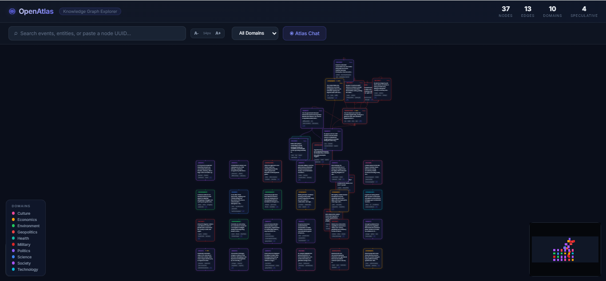
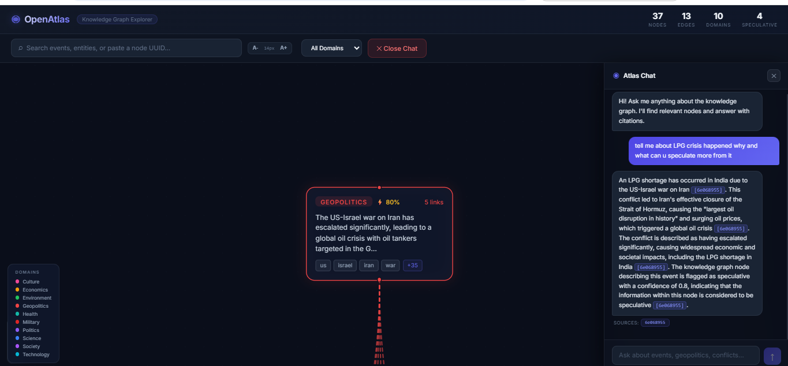

  # ◉ OpenAtlas

**OpenAtlas** is an AI-powered Global Ontology Engine that transforms raw, fragmented news data into a structured, interactive Knowledge Graph. It provides geopolitical analysts and researchers with a "macroscope" to visualize the hidden connections between world events.



## 🚀 The Vision
In an era of information overload, understanding the relationship between a trade deal in Asia and a policy shift in Europe is nearly impossible. OpenAtlas automates the extraction of entities, events, and causal links to build a living map of global affairs.

## ✨ Features (MVP)
- **Interactive Knowledge Graph**: High-performance visualization with domain-specific coloring and automated relationship detection.
- **Atlas Chat (RAG)**: A dedicated AI copilot that answers natural language questions by querying the knowledge graph and citing its sources.
- **Smart Navigation**: Click a source in the chat to auto-pan and zoom to that event in the graph.
- **Global Scaling**: Adjustable UI font size for accessibility and presentation.



## 🛠️ Technology Stack
- **Frontend**: React, Vite, React Flow (@xyflow/react), Vanilla CSS.
- **Backend**: FastAPI (Python), Uvicorn.
- **Intelligence**: Google Gemini 2.5 Flash.

## 📦 MVP vs. Production Pipeline

### **Current MVP State**
This repository comes pre-loaded with a **static dataset and pre-built graph** (`data/graph.json`). This allows for immediate exploration and testing of the visualization and RAG (Retrieval-Augmented Generation) capabilities without requiring setup for multiple external news APIs.

### **The Full Intelligent Pipeline**
In a production environment, OpenAtlas operates as a **continuous self-evolving system**:
1. **Real-time Ingestion**: A server-side pipeline constantly polls global news sources (RSS, Tavily, MediaStack).
2. **Autonomous Graph Refinement**: The AI doesn't just add nodes; it constantly reviews the existing graph to:
   - **Create New Connections**: Linking incoming news to historical events based on evolving geopolitical context.
   - **Prune & Merge**: Removing redundant nodes and consolidating information as stories develop.
   - **Improve Quality**: Re-analyzing existing nodes with updated context to maintain a high-fidelity ontology.

## 🏁 Quick Start

### 1. Prerequisites
- Python 3.10+
- Node.js 18+
- Google AI Studio API Key (Gemini)

### 2. Environment Setup
Create a `.env` file in the root directory and add your Google API key:
```env
GOOGLE_API_KEY=your_gemini_api_key_here
```
*Note: This key is required for the **Atlas Chat** to analyze context and answer questions.*

### 3. Running the Application
Run the included start script for your OS:

- **Windows**:
  ```cmd
  start.bat
  ```
- **Linux/Mac**:
  ```bash
  chmod +x start.sh && ./start.sh
  ```

Once running, the app will be available at **http://localhost:8000**.

## 📖 How to Use
1. **Explore**: Use your mouse to zoom and pan across the graph. Each node represents a distinct news event.
2. **Details**: Click on any node to open the **Detail Panel** on the right, showing the full event summary, key elements, and connections.
3. **Search**: Use the search bar in the toolbar to find specific topics or events by keyword or UUID.
4. **Chat**: Click the **Atlas Chat** button. Ask questions like *"What are the current tensions in the Middle East?"* or *"Explain the latest tech developments."* 
5. **Cite & Trace**: When the AI answers, it will provide citation chips. Click on them to instantly jump to that node on the graph.

## 📊 Impact
OpenAtlas reduces the time required to link disparate news events by over 90%, moving from manual spreadsheet tracking to automated, visual intelligence.
